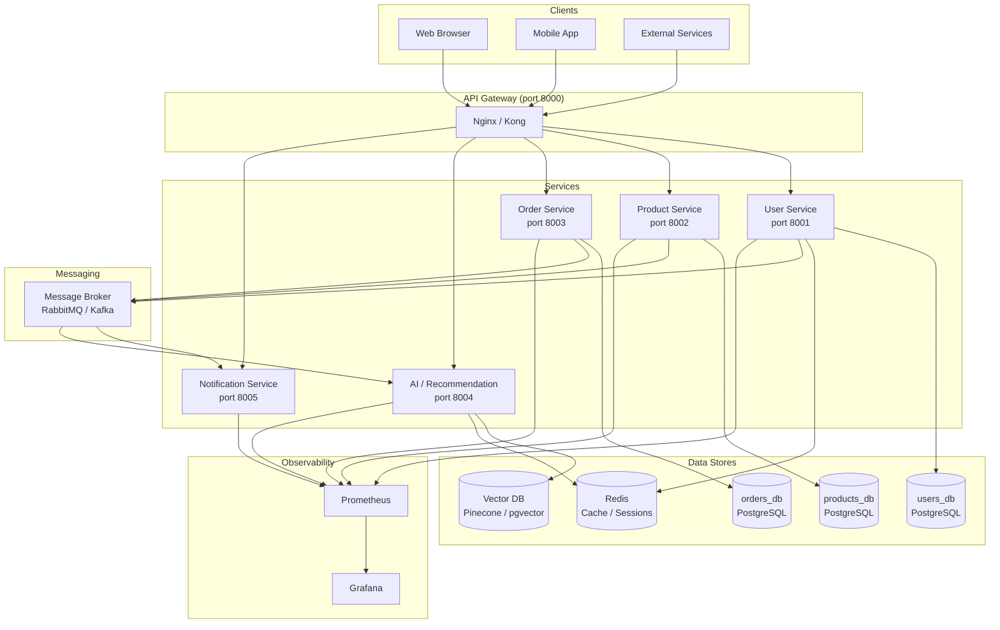

# AI E-Commerce Platform

A microservices-based e-commerce platform with AI-powered features, built on FastAPI, PostgreSQL, Redis, and deployed via Docker.

---

## High-Level Architecture



---

## Services

| Service | Port | Database | Description |
|---|---|---|---|
| **User Service** | 8001 | `users_db` | Registration, JWT auth (RS256), profiles, RBAC |
| Product Service | 8002 | `products_db` | Catalogue, inventory, search |
| Order Service | 8003 | `orders_db` | Cart, checkout, order lifecycle |
| AI / Recommendation | 8004 | Vector DB | Personalised recommendations, semantic search |
| Notification Service | 8005 | — | Email / push via message broker |

---

## Tech Stack

| Layer | Technology |
|---|---|
| Framework | FastAPI 0.115 |
| ORM | SQLAlchemy 2.0 async (asyncpg) |
| Migrations | Alembic |
| Validation | Pydantic v2 |
| Auth | PyJWT RS256 + bcrypt |
| Cache / Sessions | Redis (aioredis) |
| Metrics | Prometheus + prometheus-fastapi-instrumentator |
| Containerisation | Docker + Docker Compose |
| Python | 3.12 |

---

## Quick Start

### Prerequisites
- Docker & Docker Compose
- Python 3.12+ (for local development)

### 1. Clone and configure

```bash
git clone <repo-url>
cd ai-ecommerce-platform
```

### 2. Generate RSA keys for the User Service

```bash
cd services/user-service
python scripts/generate_keys.py        # writes keys/private.pem + keys/public.pem
cp .env.example .env                   # fill in values
```

### 3. Start all services

```bash
docker compose up --build
```

### 4. Access the APIs

| Service | Docs |
|---|---|
| User Service | http://localhost:8001/docs |
| Health checks | http://localhost:{port}/health |
| Metrics | http://localhost:{port}/metrics |

---

## Project Structure

```
ai-ecommerce-platform/
├── services/
│   ├── user-service/          # Auth, users, profiles
│   ├── product-service/       # (planned)
│   ├── order-service/         # (planned)
│   ├── ai-service/            # (planned)
│   └── notification-service/  # (planned)
├── gateway/                   # API gateway config
├── infra/                     # Docker Compose, Terraform
└── README.md
```

---

## Security

- All inter-service JWT verification uses the RS256 public key fetched from `GET /auth/public-key` on the User Service.
- Refresh tokens are stored as SHA-256 hashes in Redis with a configurable TTL.
- Passwords are hashed with bcrypt (12 rounds).
- Private key files (`keys/private.pem`) must never be committed — add `keys/` to `.gitignore`.
